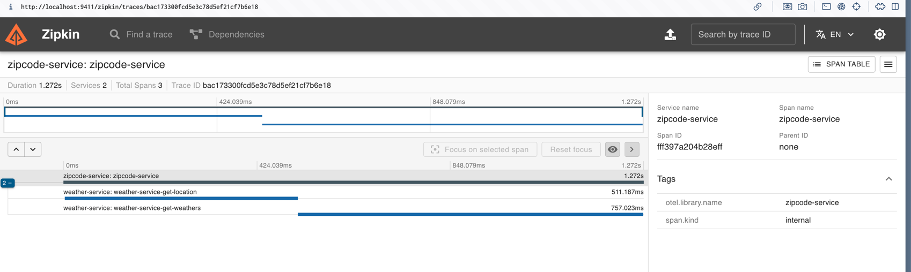

# Projeto OpenTelemetry com ZipCodeService e WeatherService

Este projeto demonstra a configuração de tracing distribuído utilizando OpenTelemetry com dois microserviços: ZipCodeService e WeatherService. 
O ZipCodeService consulta o WeatherService e propaga o contexto de tracing entre eles, permitindo a visualização das requisições distribuídas no Jaeger.

## Pré-requisitos
- Docker
- Docker Compose

## Estrutura do Projeto
```plaintext
open-telemetry/
│
├── docker-compose.yml
├── otel-collector-config.yml
├── prometheus.yml
│
├── zipcodeservice/
│   ├── main.go
│   ├── handler.go
│   ├── zipcodeservice.Dockerfile
│
├── weatherservice/
│   ├── main.go
│   ├── handler.go
│   ├── weatherservice.Dockerfile
│
├── configs/
│   ├── config.go
│
├── repository/
│   ├── locationRepository.go
│   ├── weatherAPI.go
│
├── tracing/
│   ├── tracing.go
│
└── webserver/
    ├── webserver.go
```

## Como Executar o Projeto

### Passo 1: Configurar o Ambiente

1. Clone o repositório:
```bash
git clone https://github.com/seu-usuario/open-telemetry.git
cd open-telemetry
```

2. Configurar o Docker Compose:
- O arquivo docker-compose.yml já está configurado para subir os serviços zipcodeservice, weatherservice, otel-collector, jaeger e prometheus.

### Passo 2: Build e Inicialização dos Serviços

1. Construir as imagens Docker:
```bash
docker-compose build
```

2. Iniciar os serviços:
```bash
docker-compose up
```

### Passo 3: Acessar os Serviços
- Jaeger: http://localhost:16686
- Prometheus: http://localhost:9090
- ZipCodeService: http://localhost:8080/zipcode
- WeatherService: http://localhost:8081/weather

### Passo 4: Testar os Endpoints

Você pode usar ferramentas como curl, Postman ou qualquer cliente HTTP para enviar requisições aos endpoints do ZipCodeService e WeatherService.

```bash
curl -X POST http://localhost:8080/zipcode \
  -H "Host: localhost:8000" \
  -H "Content-Type: application/json" \
  -d '{"zipcode":"80320310"}'
```

## Visualização do Tracing

Após enviar requisições para os serviços, você pode visualizar os traces no Jaeger. 
Os spans devem mostrar a sequência de chamadas entre os serviços ZipCodeService e WeatherService.

### Estrutura do Código

- zipcodeservice/main.go: Configuração do servidor e inicialização do tracing.
- zipcodeservice/handler.go: Handler que processa as requisições de zipcode.
- weatherservice/main.go: Configuração do servidor e inicialização do tracing.
- weatherservice/handler.go: Handler que processa as requisições de weather.
- tracing/tracing.go: Configuração do OpenTelemetry para inicializar o provedor de tracing.
- configs/config.go: Configuração dos serviços.
- repository: Implementações dos repositórios para integração com APIs externas.
- webserver/webserver.go: Configuração do servidor HTTP.


